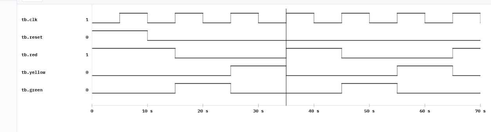
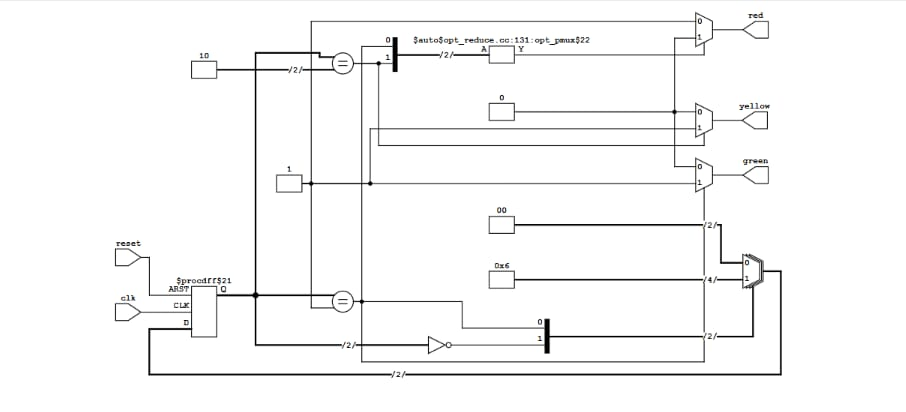

# Traffic Light Controller

## Project Overview

This project implements a simple Traffic Light Controller using Verilog HDL.

The design is based on a Finite State Machine (FSM) that controls three traffic light states: RED, GREEN, and YELLOW.

## State Sequence

The traffic light follows this sequence:

RED → GREEN → YELLOW → RED

## Inputs

- `clk` - Clock signal
- `reset` - Reset signal

## Outputs

- `red` - Red traffic light
- `yellow` - Yellow traffic light
- `green` - Green traffic light

## FSM States

| State | Active Output |
|-------|---------------|
| RED | Red |
| GREEN | Green |
| YELLOW | Yellow |

## Language

- Verilog HDL

## Tools Used

- VeriSim

## Simulation Results

The Traffic Light Controller was simulated successfully.

The waveform demonstrates the correct sequence:

RED → GREEN → YELLOW → RED

### Waveform

### RTL Schematic

## Project Files

- `tlc.v` - Traffic Light Controller design
- `tlc_tb.v` - Verilog testbench
- `waveform.jpeg` - Simulation waveform
- `rtl_schematic.jpeg` - RTL schematic
